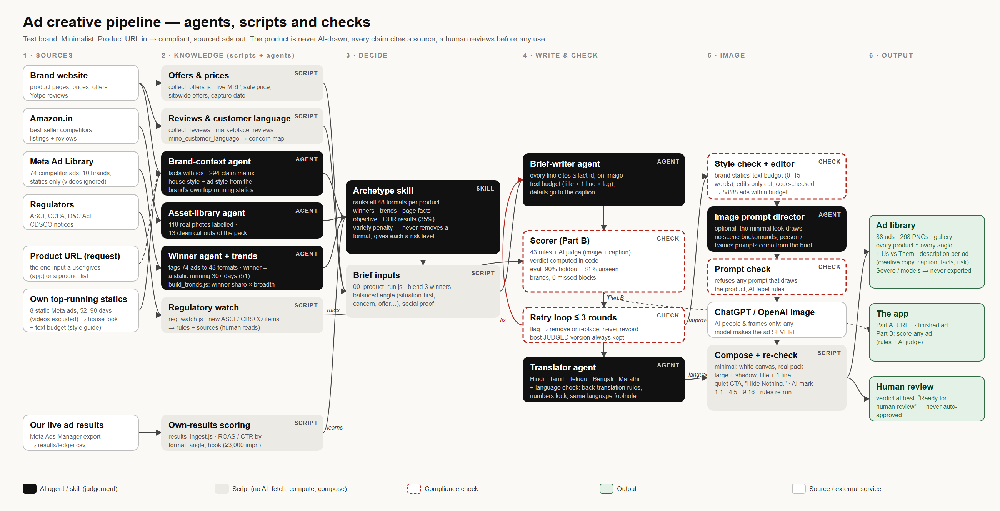

# Minimalist Ad Desk (prototype)

An ad creative tool for a beauty and personal-care brand. **Minimalist (beminimalist.co) is the test brand**, used to build and prove the pipeline; swapping the brand pack points the same pipeline at any other brand. Nothing here is published, and every creative carries an "INTERNAL TEST" mark.

It has three parts:

| Part | What it does | Where |
|---|---|---|
| **A. Product URL → finished ad** (app) | Paste a product URL and get a composed 1080×1080 ad: the real pack shot, copy built only from facts on that page, each line citing its fact, pre-screened before export. | `npm start` → http://localhost:5173 |
| **B. Score any ad** (app) | Paste or upload any ad (yours, an agency's, a creator's, a competitor's). You get a verdict plus each flagged phrase with severity, rule, source and suggested fix, covering policy/claims, brand tone and brand language. | same app (scoring surface) |
| **Ad library pipeline** (built on A + B) | Takes proven competitor ads, chooses formats per product, writes cited briefs, then runs compliance (rules + AI judge, retry loop), image prompts, AI backgrounds, the real pack shot composited in, 3 sizes plus Hindi/regional versions, and saves everything with descriptions. | `pipeline/RUNBOOK.md`, output in `ad_library/` |



## Setup on a new device (about 5 minutes)

**Required:**
- **Node.js 20 or newer** (built and tested on Node 24). There are **no npm packages to install**; the tool uses only Node's built-ins.
- **Git**, only if you want the commit history (`git clone` the repo, or copy the folder).

**Optional, needed only for the parts listed:**
- **Microsoft Edge, Chrome or Chromium:** turns finished ads into PNGs (`pipeline/08b_png.js`). It's found automatically on Windows, macOS and Linux; otherwise set `BROWSER=/path/to/browser`.
- **Python 3 with Pillow** (`pip install pillow`): only to rebuild product cut-outs (`scripts/make_cutouts.py`) and contact sheets.
- **API keys:** create a file named `.env` in this folder (never paste keys into chat or commit them):
  ```
  ANTHROPIC_API_KEY=...   # AI judge + AI-written copy in the app (otherwise rules-only, and the app says so)
  OPENAI_API_KEY=...      # automatic background images (otherwise generated in ChatGPT via the browser)
  ```

**Run:**
```bash
npm start          # the app: http://localhost:5173 (PORT=xxxx to change)
npm test           # 40 unit/regression tests
npm run eval       # the scorer evaluation (see eval/README.md)
```

**Without keys the tool still works, with less coverage, and it says so:** copy is taken word for word from the product page, the scorer runs its rule layer only, and the verdict reads "limited check", never a pass.

## The ad library pipeline in one screen

Each step and its check is in `pipeline/RUNBOOK.md`. In short:

1. **Live data (scripts, no browser):**
   - `scripts/collect_offers.js`: live prices, MRP and sitewide offers;
   - `scripts/collect_reviews.js`: real reviews and star rating;
   - `scripts/collect_marketplace_reviews.js`: Amazon.in best-seller competitors and their reviews;
   - `scripts/mine_customer_language.js`: customer concerns, and which page fact answers each;
   - `scripts/reg_watch.js`: ASCI/CDSCO watch.
2. **Pick formats:** `node pipeline/00_product_run.js <run> 4 <product-handle> …`. The archetype skill ranks all 48 formats on competitor winners, trends, page facts and our own results. It never removes a format; it gives each a risk level. Every concept blends 3 winning competitor ads, and the angles are balanced across the run.
3. **Write briefs** with the brief-writer prompt (`prompts/pipeline_brief_writer.md`). Every line cites a fact.
4. **Compliance:** `node pipeline/05_compliance.js <run>` runs 43 rules plus the AI judge. `05b_retry.js` runs up to 3 retry rounds and always keeps the best judged version.
5. **Language versions** (optional): `prompts/translator.md`, then `05c_translate_check.js` (back-translation, numbers lock, risky words, same-language disclaimer).
6. **Image prompts:** `06b_director_inputs.js`, then the director prompt, then the `06c_prompts.js` re-check. Prompts are background only; the product is never AI-drawn.
7. **Backgrounds:** ChatGPT (you log in, the browser pastes the prompts) or the OpenAI API. Save them to `pipeline/runs/<run>/backgrounds/<id>.png`.
8. **Compose:** `08_compose.js <run>` (real cut-out with shadow, 1:1 + 4:5 + 9:16, language versions), then `08b_png.js <run>`.
9. **Library:** `09_library.js <run>` writes `ad_library/<product>/<format>/` with a description per ad.
10. **Learn:** add live results to `results/ledger.csv`, then run `node scripts/results_ingest.js`; formats that work for us rise in ranking.

## Where things are

| Folder | Contents |
|---|---|
| `lib/` | Rules engine, AI judge, archetype ranking, brief checks, language checks, image-prompt check |
| `rules/brand_rules.json` | The 43 brand/compliance rules, each with severity, rationale and sources |
| `research/` | Regulatory sources (66), competitor ads (74), winners, trends, competitor map, customer language, regulatory watch |
| `brand_packs/minimalist/` | Brand facts, claims matrix, channel listings, house style, asset library (real photos and cut-outs) |
| `prompts/` | Every prompt the tool uses, as files |
| `pipeline/` | The ad library pipeline, `RUNBOOK.md`, and runs (`pipeline/runs/<run>/`) |
| `ad_library/` | Finished ads with descriptions (`INDEX.md`) |
| `docs/` | `DECISIONS.md` (one-page decision doc), `FAILURE_MODES.md`, `ARCHITECTURE.md`, `TRANSCRIPT.md` |
| `eval/` | Labelled test set and results for the scorer |
