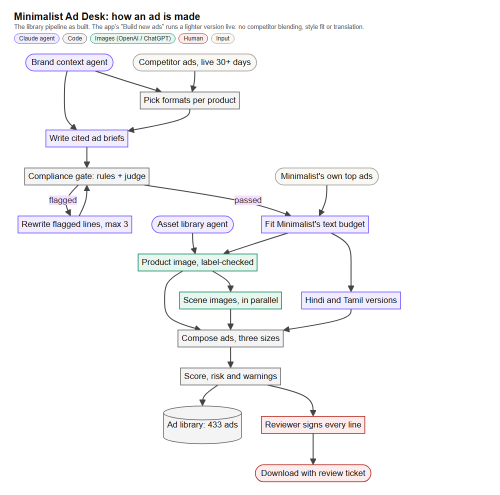

# Minimalist Ad Desk: one page

**The ask, in the brief's own words:** make ads the way "the video script and image brief generator we made" does, "but instead that is passed to ChatGPT for image generation": competitor ads that ran 30+ days feed "the brand context engine", "then the brief passes through the compliance, and then GPT receives things". Minimalist is the test brand, "so the same pipeline can later be reused for other brands". **Run it:** `npm start`, open http://localhost:5173, add a Claude and an OpenAI key (or continue without them). Repo: github.com/pranjalsharma-838/minimalist-ad-tool.

## How it works

Purple: Claude agents · grey: code · green: images (OpenAI first, ChatGPT as backup) · red: human sign-off. The gate loops flagged lines back up to 3 times; the product image is checked word by word against the real label before any scene is made. Source: `docs/how_it_works.html`.

17 agreed formats + 2 proof ads per product, ranked from 122 competitor statics. The library holds **433 ads** for the top 20 sellers + the underarm roll-on: 391 ready for human review, 41 need a fix, 1 blocked; **242 can be downloaded after review today** (the rest show AI people or results and need real, consented photos first). Every not-ready ad shows why.

## How ads are rated

| | Values | Set by |
|---|---|---|
| Problem severity | **Block** / **Fix** / **Advisory** | 44 rules (Indian ad law, platform policy, brand voice); the AI judge can only be milder |
| Verdict | Ready for human review / Needs a fix / Blocked, never "approved" | Code, from the findings ("Humans approve") |
| Risk | Low / Medium / High / **Severe** (AI people or results: no download until real photos) | Format and imagery |
| Scores | Brand alignment, Chance to win (0–100), Compliance | Brand's own long-running ads; 30+ day survival of comparable statics |

**Checker accuracy:** 90% of reviewer-flagged phrases on held-back ads (rules alone 52%), 81% on unseen brands, no missed blocks; measured with a Claude stand-in on the exact judge prompt.

## Decisions (applied in code)

Acne wording allowed (DEC-01) · comparisons in, with proof (DEC-02/03) · AI textures Low risk (DEC-04) · "things mentioned in the listing will be treated leniently" (DEC-05) · pregnancy/lactation on the listing accepted (DEC-06) · AI images: "don't block, just a warning", rated Severe (DEC-07) · customer quotes fine, "consent needed if name is shown" · AI judge "strictly sticks to rules" · baby products: ads made, Severe, parent-and-baby scenes, no result images · product image first, then "all shoot parallely"; OpenAI first, ChatGPT as backup.

## What we fixed

"New ads loading the previously made ones" → built fresh · "many placeholders" → loading line per ad, no empty tiles · "different background, not acceptable" → every pack on pure white · "the loop I established for the product image" → products wait for the checked render · "original image missing" in the prompt → photo must attach before sending · "this is for babies" → scenes from the page's real user · Hindi/Tamil in English → line-by-line swap · client name, emails, passwords → removed everywhere.

## Not yet proven

The AI judge and copy model ran as stand-ins (no keys); `scripts/check_claude_route.mjs` and `check_api_route.mjs` re-run them live. The win score is a proxy until ads run with real spend. Detail: `docs/SUBMISSION.md`, `DECISIONS.md`, `FAILURE_MODES.md`, `TRANSCRIPT.md`.
